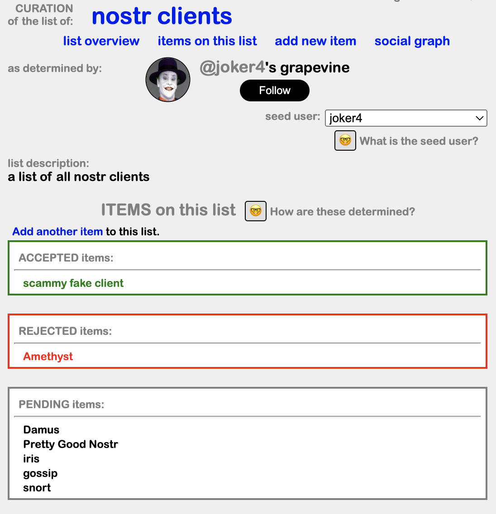
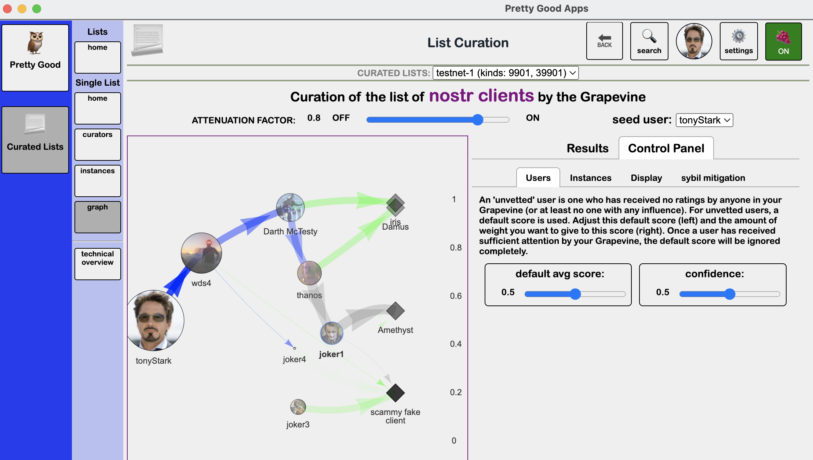

Curated Lists
=====

Curated Lists is built as a proof of concept for all of the [core principles and goals](https://github.com/wds4/DCoSL/tree/main/dips/coreProtocol) of DCOSL (with the exception of DIP-infiity), most notably DIPs 01 and 02.

Curated Lists allows any user to create a new list, add an item to any list, endorse or reject any user as a curator of any given list, and accept or reject any submitted item as belonging to the list in question. Submissions and endorsements are stored in nostr using kinds 9901 or -02 (submissions of lists and list items) and 39901 or -02 (for endorsements), following conventions outlined in [the concept graph](https://github.com/wds4/DCoSL/tree/main/dips/conceptGraph) (24 June 2023: extensive information has been added, but still much editing to do). These submissions and endorsements are used to generate lists, following conventions outlined in [the grapevine](https://github.com/wds4/DCoSL/tree/main/dips/grapevine).

### Curated Lists Example: Curation of a list of nostr clients

In this example, a list of nostr clients has been created and curated. The results of curation are shown below, first from the perspective of the user "joker" (created by me to illustrate a bad actor), then from the perspective of the user "wds4."

  

  

Note that, in accordance with [DIP-01](https://github.com/wds4/DCoSL/blob/main/dips/coreProtocol/01.md), the resuls of curation depend upon the choice of seed user.

This example serves to illustrate [DIP-02](https://github.com/wds4/DCoSL/blob/main/dips/coreProtocol/02.md). A common practice would be to rely upon "scraped data," such as a follows list, coupled with the inference that following a profile equals trusting that profile. Such inferencesare frequently wrong, which is why DCoSL rejects the use of scraped data. In this example, following DIP-02, list curation is based entirely on explicit endorsements (or rejection) of users as curators of this list plus explicit endorsements (or rejection) of list items (nostr clients) as belonging (or not belonging) to the list.

The below two panels illustrate curation of the list of nostr clients from the perspective of the user "tonyStark," set as the seed user. Circles represent users, with circle radius being proportional to the amoount of <i>influence</i> that user carries on the curation of the list being depicted. 

  

  

