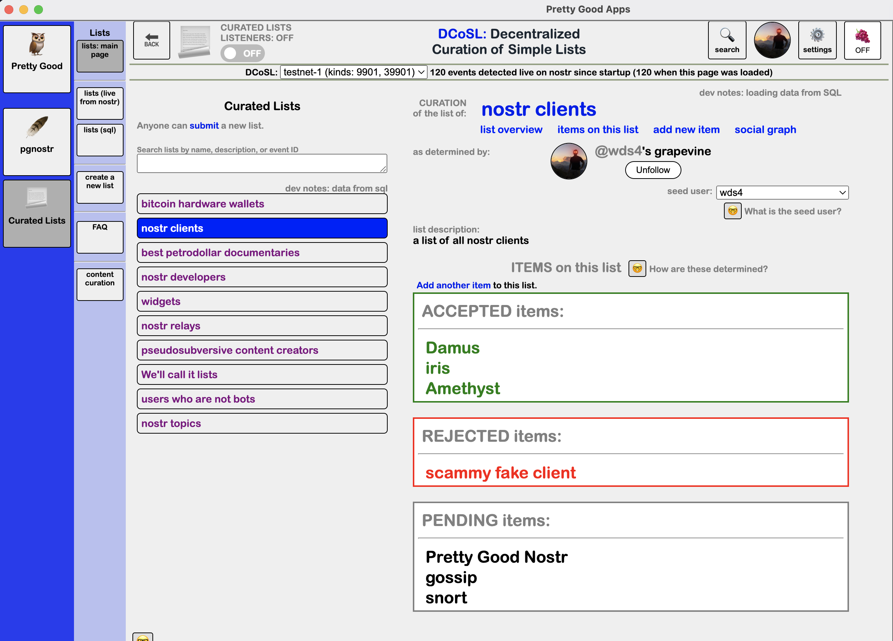
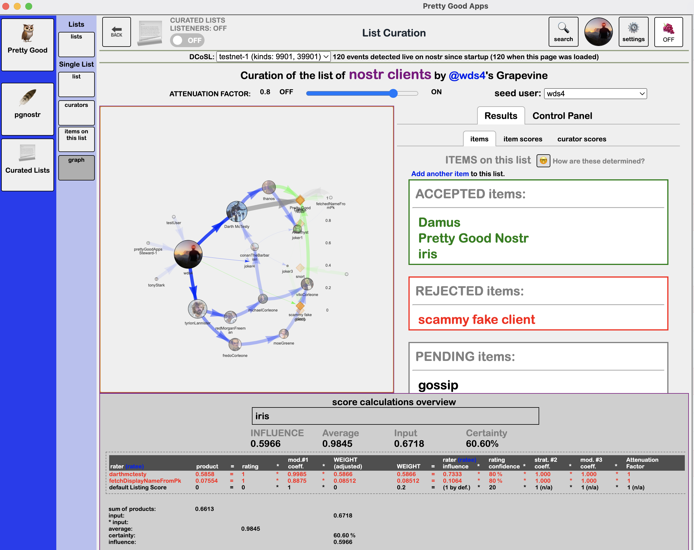
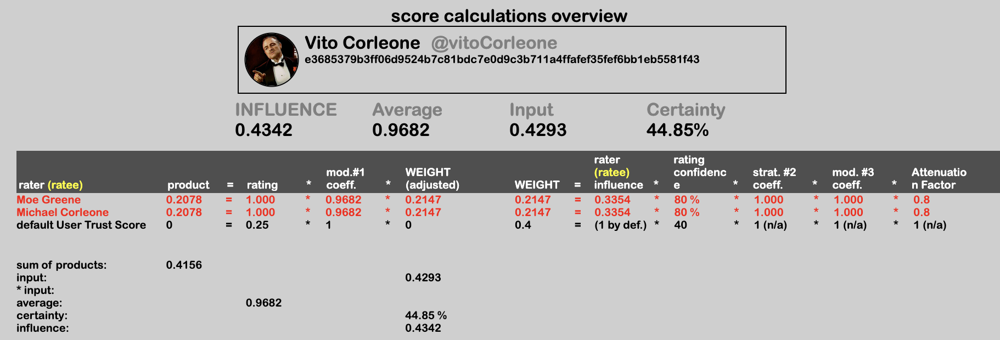
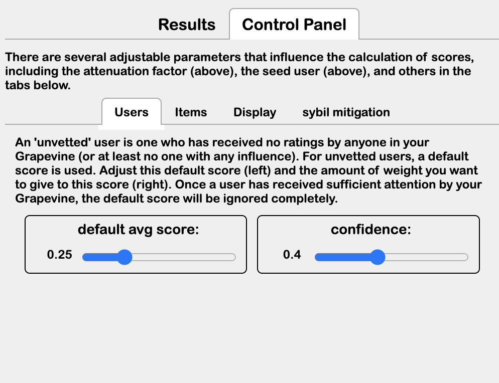
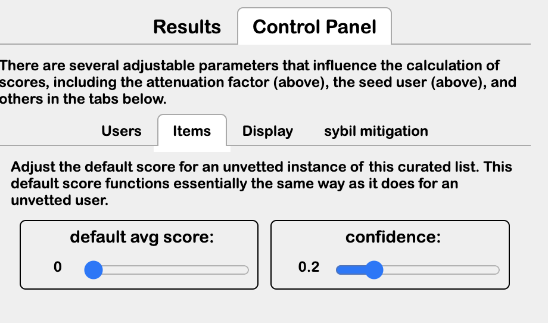

Screenshots from the Curated Lists app.

## Main landing page:

  

## graphical depiction of the web of trust involved in list curation

  

## show calculations for a user's average trust score

  

## control panel: default user curator trust scores

  

## control panel: default list item scores

  

