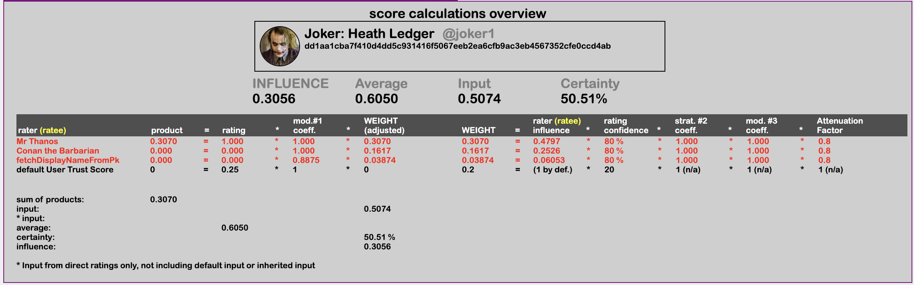
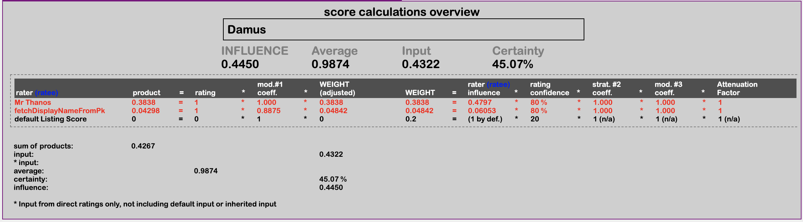

Go back to [overview of curated lists page](https://github.com/wds4/pretty-good/blob/main/appDescriptions/curatedLists/overview.md)

# How are calculations performed?

For each list, your web of trust determines which items are ACCEPTED, which are REJECTED, and which are PENDING.

# Screenshots

The PGA desktop app lets you review the raw data and all calculations.

## Curator score

- determines how much influence any given user has over the items on this list, as well as the scores of other curators

  

## Item score

- determines whether this item belongs on the accepted, the rejected, or the pending list

  

# Control Panel settings

See the [overview page](https://github.com/wds4/pretty-good/blob/main/appDescriptions/curatedLists/overview.md) (scroll to the bottom) for an overview of the control panel settings.

# How is the data processed?

## Inputs

- lists and list items
- ratings of list items
- ratings of users
- control panel settings

Calculations for each list are performed separately.

Step 1: calculate curator scores.
Step 2: calculate item scores.
Step 3: distribute items into accepted, rejected, and pending bins based on their scores

## Basic principles

- Average scores are calculated as *weighted* averages.

## Not yet implemented in the v0.2.1-alpha release: trust score hierarchy

A hierarchy of curator scores will be created, with a generic trust score at the top of the hierarchy and with default trust scores inherited from top of the hierarchy (generic) to the bottom (specific). This will have the benefit that when highly specific, niche topic lists are created that may have a paucity of curator trust scores, list items can be processed based on inherited trust scores.

