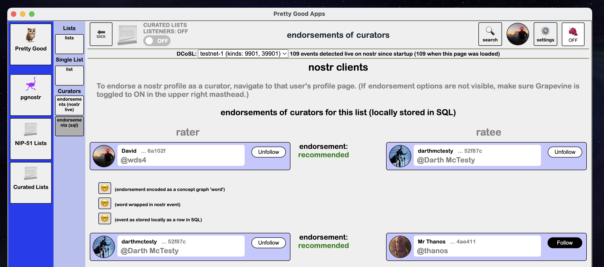
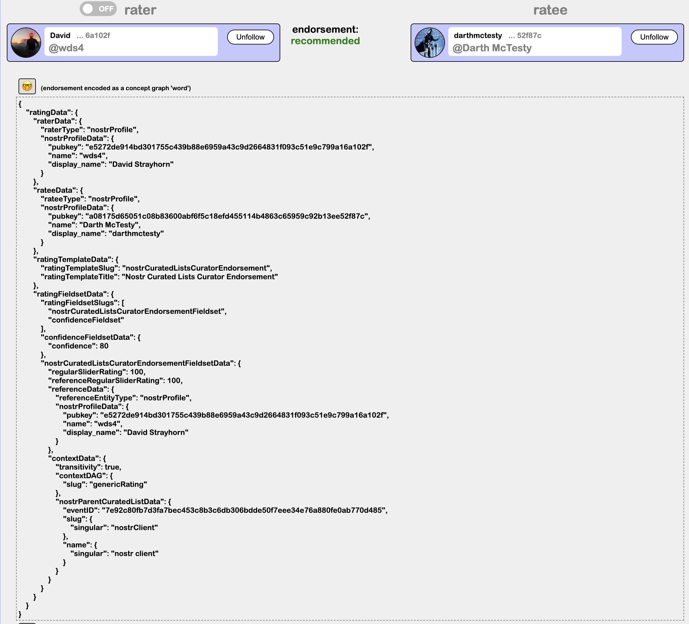
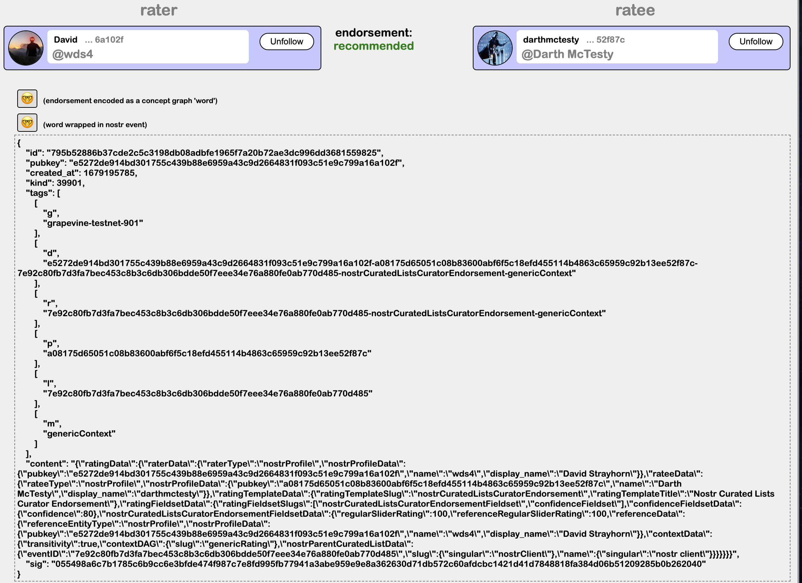

Go back to [overview of curated lists page](https://github.com/wds4/pretty-good/blob/main/appDescriptions/curatedLists/overview.md)

# Curator Ratings

All ratings of curators of a selected list can be viewed on either of the Endorsements of Curators pages: one page for all those actively downloadable on nostr; one page for all those that are stored locally in the PGA sqlite3 database.

  

## Rate curator: example

  

The above JSON is wrapped and broadcast as a kind 39901 event (Parameterized Replaceable Event) as shown below.

  

