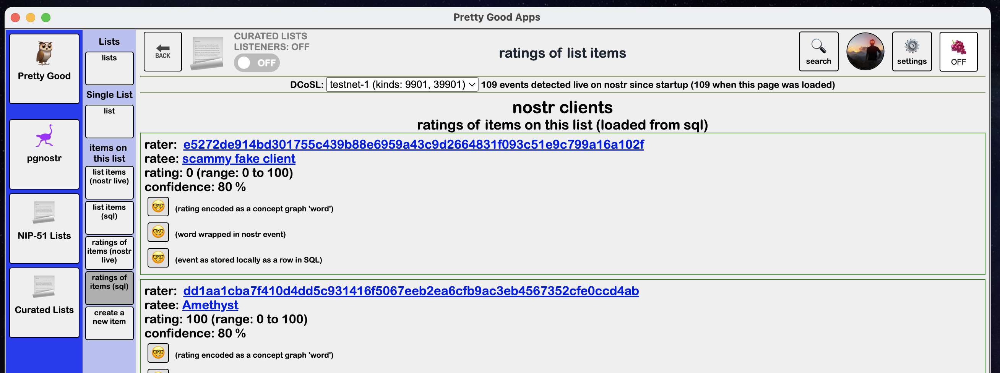
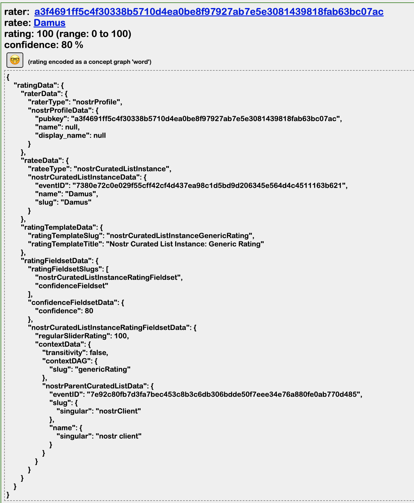
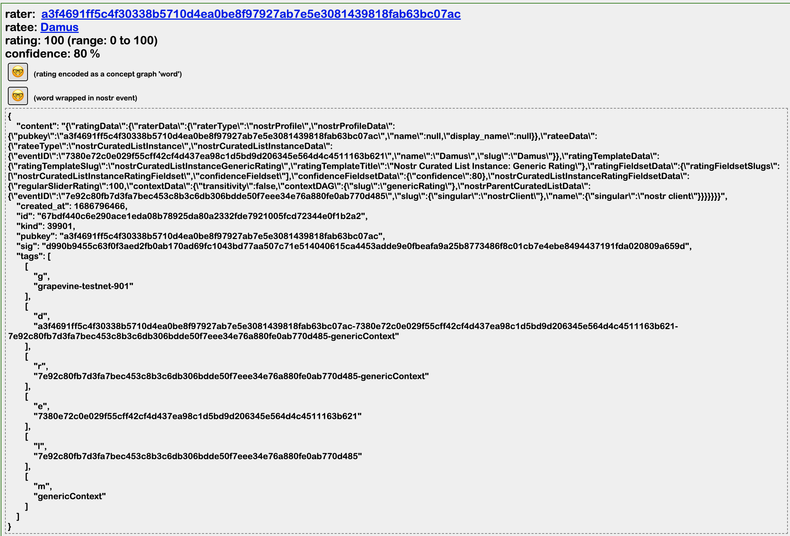

Go back to [overview of curated lists page](https://github.com/wds4/pretty-good/blob/main/appDescriptions/curatedLists/overview.md)

# Ratings of Items

All ratings of items of a selected list can be viewed on either of the Ratings of List Items pages: one page for ratings actively downloadable on nostr; one page for all ratings that are stored locally in the PGA sqlite3 database.

  

## Rate item: an example

  

The above JSON is wrapped and broadcast as a kind 39901 event (Parameterized Replaceable Event). Parameterized Replaceable Events are utilized so that the rater can update or delete the rating. Setting regularSliderRating to null is interpreted as a deleted rating.

Several tags are employed to increase the efficiency of finding ratings of a desired category, e.g. ratings of a particular item, of items on a particular list, etc.

  

