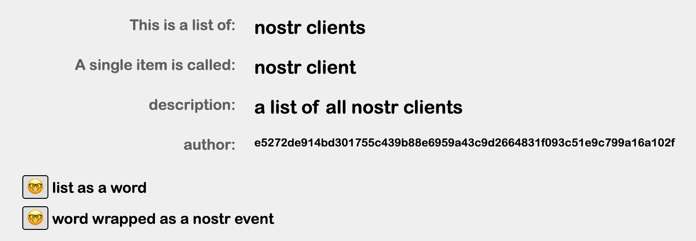
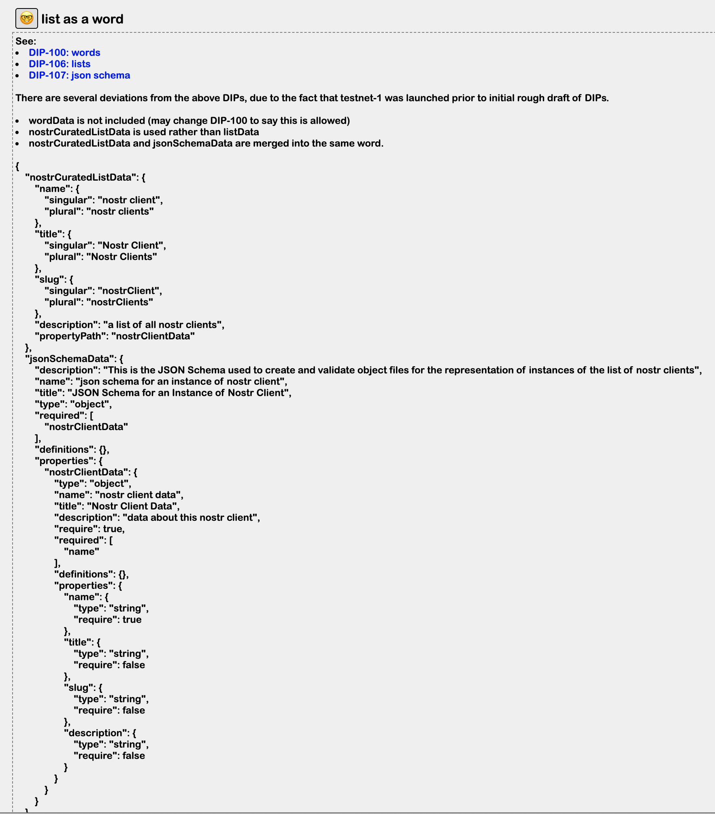
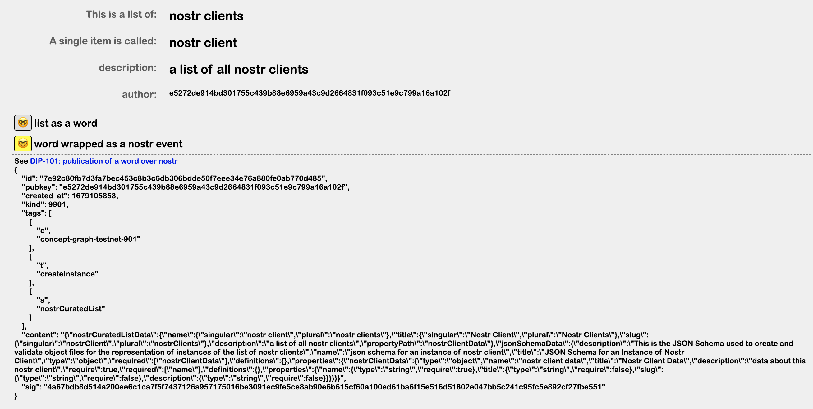

Go back to [overview of curated lists page](https://github.com/wds4/pretty-good/blob/main/appDescriptions/curatedLists/overview.md)

# Overview of the list of Nostr Clients

When a new list is created, it is stored in nostr as a kind 9901 event. Information about the list is provided by the list overview page.

### General info about the list of Nostr Clients

  

The smiley faces can be expanded to reveal techincal info about how the list is encoded and stored on nostr, as per the DCoSL [Concept Graph protocol](https://github.com/wds4/DCoSL/tree/main/dips/conceptGraph).

(Smiley faces with tech info are invisible unless the "show developer details for nostr nerds" option is checked under the settings for Pretty Good.)

### List info encoded in JSON

  

### JSON wrapped into a kind 9901 event

  

