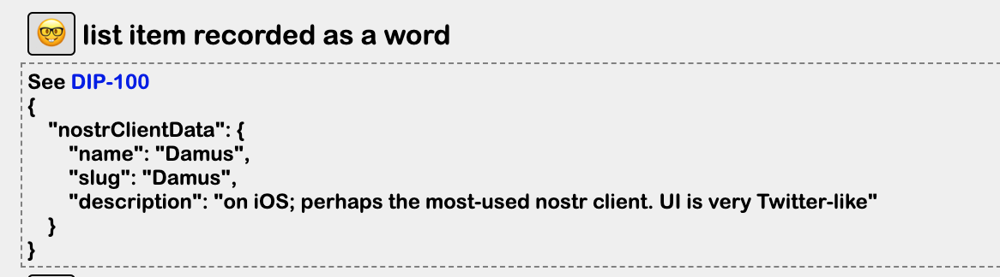
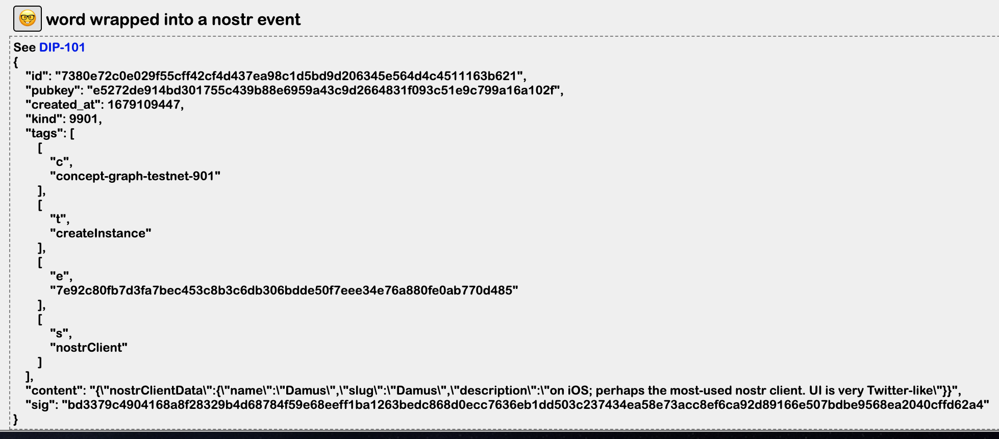

Go back to [overview of curated lists page](https://github.com/wds4/pretty-good/blob/main/appDescriptions/curatedLists/overview.md)

# Overview of the item: Damus, an item on the list of Nostr Clients

When a new item is created, it is stored in nostr as a kind 9901 event. Information about the item is provided by the List Item overview page.

### General info about the item: Damus

  

To rate an item as belonging (or not) on the list, go to the List Item information page (below) and toggle the Endorse / Unendorse (thumbs up) or Block / Unblock (thumbs down) buttons under "rate this item."

The smiley faces can be expanded to reveal technical info about how the list is encoded and stored on nostr, as per the DCoSL [Concept Graph protocol](https://github.com/wds4/DCoSL/tree/main/dips/conceptGraph).

(Smiley faces with tech info are invisible unless the "show developer details for nostr nerds" option is checked under the settings for Pretty Good.)

### Item info encoded in JSON

  

### JSON wrapped into a kind 9901 event

  

